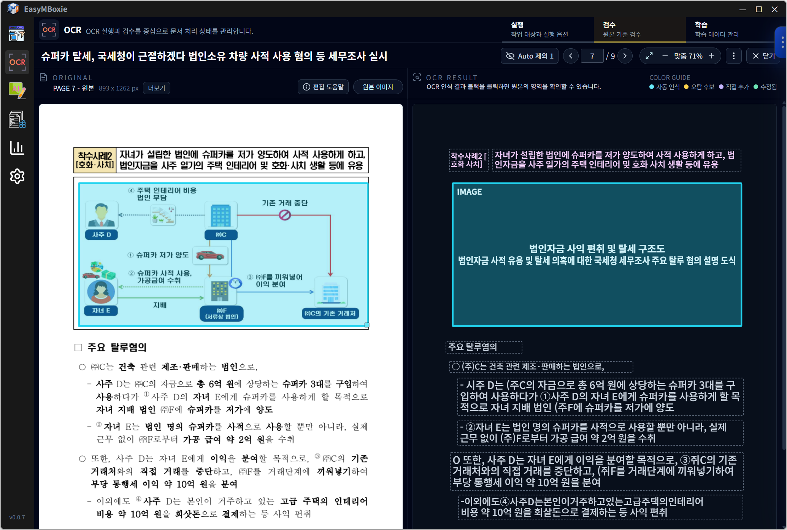
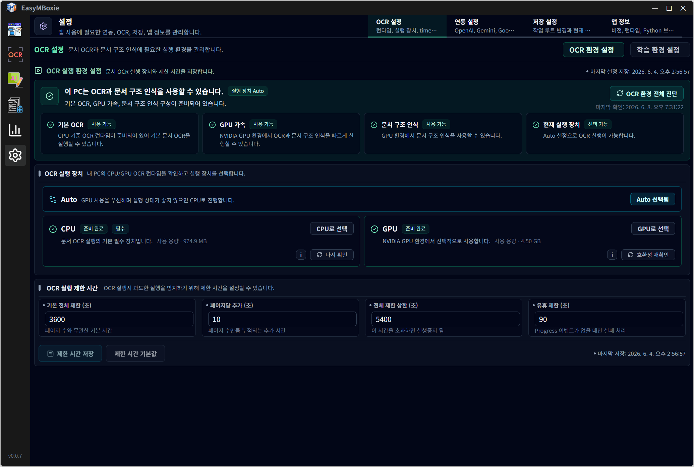

# EasyMBoxie

<p align="center">
  
</p>

이미지와 PDF를 OCR로 읽고, 검수 가능한 문서 구조로 정리한 뒤, AI 초안 생성과 파일 내보내기, WordPress 발행까지 이어주는 로컬 우선 데스크톱 앱입니다.

EasyMBoxie는 단순히 문서를 텍스트로 바꾸는 도구가 아니라, 스캔본이나 이미지 문서를 다시 편집 가능한 작업물로 만들고 게시나 업무 산출물까지 연결하는 것을 목표로 합니다.

> 현재 이 저장소는 EasyMBoxie의 공개 배포 및 피드백 수집용 저장소입니다. 앱 소스코드는 포함하지 않으며, 실행 파일은 GitHub Releases를 통해 배포합니다.

## 주요 기능

- 이미지/PDF 파일 등록 및 작업 대상 관리
- 로컬 OCR 기반 텍스트 추출
- PaddleOCR / PaddleOCR-VL 기반 문서 구조 인식
- OCR 결과 검수, 교정, 블록 정리
- 표, 이미지, 시각 자료 후보 확인
- Google Vision 기반 보정 보조
- OpenAI / Gemini 기반 게시용 AI 초안 생성
- AI 결과 편집 및 TXT, Markdown, HTML, JSON, DOCX 내보내기
- WordPress 연결 테스트 및 게시 흐름
- 양식 문서 템플릿 기반 값 추출, 검수, CSV/XLSX 내보내기
- AI 사용량과 외부 API 호출량 확인

## 대표 사용 흐름

1. 이미지 또는 PDF를 EasyMBoxie에 등록합니다.
2. 로컬 OCR과 문서 구조 인식으로 페이지, 텍스트, 표, 이미지 영역을 추출합니다.
3. 필요한 부분을 검수하고 교정합니다.
4. 검수 완료 데이터를 바탕으로 AI 게시 초안을 생성합니다.
5. 결과를 편집한 뒤 파일로 내보내거나 WordPress에 게시합니다.

Auto 화면에서는 위 흐름을 한 번에 실행하는 방향을, OCR과 Publish 화면에서는 각 단계를 수동으로 세밀하게 다루는 방향을 제공합니다.

## 다운로드

최신 실행 파일은 이 저장소의 **GitHub Releases**에서 받을 수 있습니다.

- 저장소: https://github.com/EasyMBoxie/easymboxie
- Releases: https://github.com/EasyMBoxie/easymboxie/releases
- 현재 공개 배포 버전: `0.0.7`

배포 파일 이름은 다음 형식을 사용합니다.

```text
EasyMBoxie-v0.0.7-windows-x64-setup.exe
EasyMBoxie-v0.0.7-windows-x64-portable.exe
EasyMBoxie-v0.0.7-windows-x64-setup.zip
EasyMBoxie-v0.0.7-windows-x64-portable.zip
SHA256SUMS.txt
```

일반적인 사용에는 설치형을 권장합니다. 설치 없이 먼저 실행해보고 싶다면 포터블 버전을 사용해 주세요.

- 설치형: `EasyMBoxie-v0.0.7-windows-x64-setup.exe`
- 포터블: `EasyMBoxie-v0.0.7-windows-x64-portable.exe`
- 설치형 압축 파일: `EasyMBoxie-v0.0.7-windows-x64-setup.zip`
- 포터블 압축 파일: `EasyMBoxie-v0.0.7-windows-x64-portable.zip`

Release에 첨부된 파일만 공식 배포 파일로 간주해 주세요.

## 실행 환경

- Windows x64 환경을 기준으로 배포합니다.
- 최초 실행 시 OCR에 필요한 로컬 Python/OCR 런타임 설치가 필요합니다.
- 앱 실행 후 `Settings > OCR 설정`에서 CPU OCR 환경을 먼저 설치해 주세요.
- AI 초안 생성, Google Vision 보정, WordPress 게시 기능은 사용자가 직접 API 키 또는 연결 정보를 설정해야 합니다.

## 권장 사양

EasyMBoxie는 CPU 환경에서도 기본 OCR과 검수 흐름을 사용할 수 있도록 설계되어 있습니다. 다만 이미지, 표, 문서 구조 분석처럼 무거운 고급 기능을 충분히 사용하려면 NVIDIA GPU 환경을 권장합니다.

### 최소 사용 환경

- Windows 10/11 x64
- 로컬 저장 공간 여유분
- CPU OCR 런타임 설치
- 인터넷 연결: 최초 OCR 런타임 설치, AI/Google Vision/WordPress 연동 사용 시 필요

### 권장 사용 환경

- Windows 10/11 x64
- NVIDIA GPU
- 최신 NVIDIA 그래픽 드라이버
- 앱 내 CPU OCR 환경 설치
- 앱 내 GPU OCR 환경 설치
- 충분한 메모리와 저장 공간

NVIDIA GPU 환경에서는 PaddleOCR-VL 기반 문서 구조 인식, 이미지 후보 찾기, 표/이미지 영역 분석 같은 고급 기능을 더 원활하게 사용할 수 있습니다. GPU 환경이 준비되지 않아도 CPU OCR로 기본 기능은 사용할 수 있지만, 일부 고급 분석 기능은 느리거나 사용성이 제한될 수 있습니다.

설치 후 `Settings > OCR 설정`에서 CPU/GPU OCR 환경을 모두 준비하는 것을 권장합니다.

Windows SmartScreen 또는 백신 프로그램이 새 실행 파일에 대해 경고를 표시할 수 있습니다. 공식 Release 페이지에서 받은 파일인지 확인한 뒤 실행해 주세요.

## 로컬 우선 설계

EasyMBoxie는 모든 원본 문서를 AI API로 그대로 보내는 방식을 지향하지 않습니다.

- OCR, PDF 렌더링, 이미지 처리, 레이아웃 정리, 검수 데이터 저장은 가능한 한 로컬에서 처리합니다.
- AI에는 원본 파일 전체가 아니라 검수/정리된 텍스트와 필요한 메타데이터를 중심으로 전달합니다.
- OpenAI, Gemini, Google Vision, WordPress 같은 외부 연동은 사용자가 설정한 경우에만 사용합니다.
- AI 사용량과 외부 API 호출량을 확인할 수 있도록 운영 지표를 제공합니다.

## 현재 메뉴

- **Auto**: 문서 등록부터 OCR, 검수 보조, AI 초안, WordPress 게시까지 이어지는 자동 실행 흐름
- **OCR**: OCR 실행, 검수, 학습 데이터 관리
- **Publish**: 검수 완료 결과 가져오기, AI 초안 생성, 편집, export, WordPress 게시
- **양식 정리**: 반복 양식 문서의 템플릿 정의, 값 추출, 검수, CSV/XLSX export
- **Dashboard**: AI 사용량과 외부 API 호출량 확인
- **Settings**: API 키, WordPress, OCR 런타임, 저장소, 앱 정보 관리

## 스크린샷

스크린샷은 `screenshots/` 폴더에서 확인할 수 있습니다.

### Auto 실행 설정


### OCR 검수



### Publish 결과 편집


### OCR 환경 설정



## 피드백

아래와 같은 피드백을 특히 환영합니다.

- 실제 업무에서 이미지/PDF 문서를 어떤 형태로 다시 만들고 싶은지
- OCR 검수 과정에서 꼭 필요한 편집 기능
- WordPress 게시 또는 파일 export에서 필요한 출력 형식
- 반복 양식 문서 처리에 필요한 필드/표 추출 방식
- 설치, 최초 실행, 런타임 준비 과정에서 불편한 점

피드백은 GitHub Issues로 남겨 주세요.

- Issues: https://github.com/EasyMBoxie/easymboxie/issues

이메일 문의가 필요한 경우 `wishlan@naver.com`으로 연락해 주세요.

## 개발 상태

EasyMBoxie는 아직 빠르게 바뀌는 초기 공개 배포 단계입니다. 기능 이름, 화면 구조, 저장 형식, 배포 방식은 피드백과 실제 사용 결과에 따라 변경될 수 있습니다.

변경 내용은 [CHANGELOG.md](./CHANGELOG.md)에 정리합니다.

## 라이선스

EasyMBoxie 공개 배포판은 오픈소스 라이선스가 아니라, 한국어권 사용자를 기준으로 작성한 바이너리 평가판 사용 허가 조건을 따릅니다.

자세한 내용은 [LICENSE](./LICENSE)를 확인해 주세요. 이 저장소는 공개 배포 및 피드백 수집을 위한 저장소이며, 별도 안내가 없는 한 앱 소스코드의 오픈소스 공개를 의미하지 않습니다.
